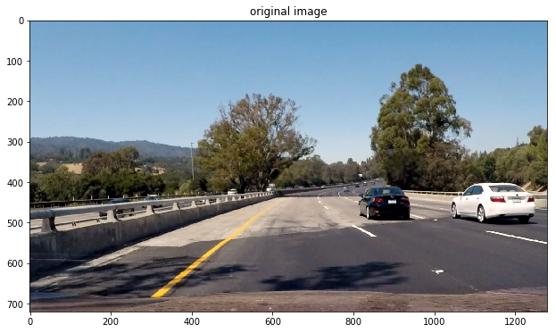
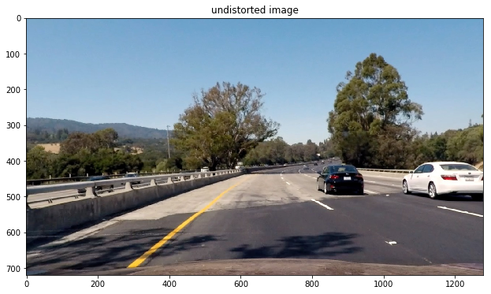
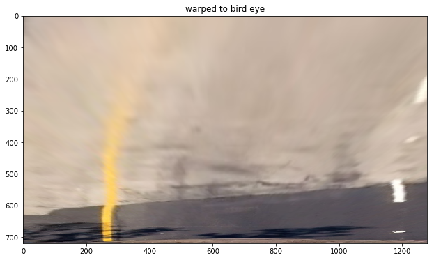
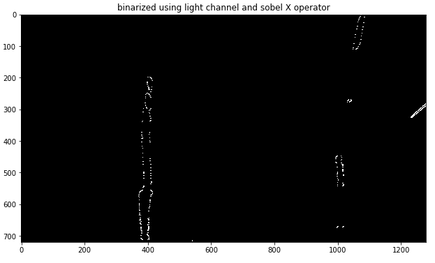
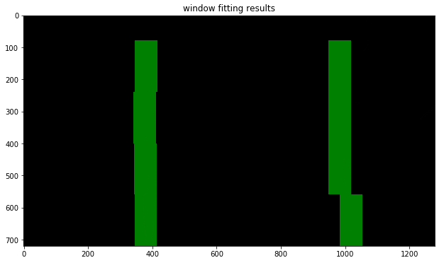
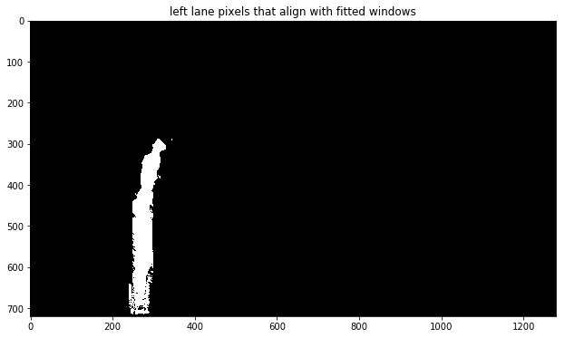

## Writeup Template

### You can use this file as a template for your writeup if you want to submit it as a markdown file, but feel free to use some other method and submit a pdf if you prefer.


Improvements

- Add a weight (closest ce)
- convolutional sliding window search
- cvw continues with the same delta, if no pixels were found

---

**Advanced Lane Finding Project**

The goals / steps of this project are the following:

* Compute the camera calibration matrix and distortion coefficients given a set of chessboard images.
* Apply a distortion correction to raw images.
* Use color transforms, gradients, etc., to create a thresholded binary image.
* Apply a perspective transform to rectify binary image ("birds-eye view").
* Detect lane pixels and fit to find the lane boundary.
* Determine the curvature of the lane and vehicle position with respect to center.
* Warp the detected lane boundaries back onto the original image.
* Output visual display of the lane boundaries and numerical estimation of lane curvature and vehicle position.

[//]: # (Image References)

[image1]: ./examples/undistort_output.png "Undistorted"
[image2]: ./test_images/test1.jpg "Road Transformed"
[image3]: ./examples/binary_combo_example.jpg "Binary Example"
[image4]: ./examples/warped_straight_lines.jpg "Warp Example"
[image5]: ./examples/color_fit_lines.jpg "Fit Visual"
[image6]: ./examples/example_output.jpg "Output"
[video1]: ./project_video.mp4 "Video"

Rubric points I considered can be found [here](https://review.udacity.com/#!/rubrics/571/view).

---

### Writeup / README

### Camera Calibration


### Pipeline (single images)

Just for reference, the original images looks like this:



#### 1. Undistorting

The code for this step is contained in the first code cell of the IPython notebook located in "real.ipny" at the very top.  

I start by preparing "object points", which will be the (x, y, z) coordinates of the chessboard corners in the world. Here I am assuming the chessboard is fixed on the (x, y) plane at z=0, such that the object points are the same for each calibration image.  Thus, `objp` is just a replicated array of coordinates, and `objpoints` will be appended with a copy of it every time I successfully detect all chessboard corners in a test image.  `imgpoints` will be appended with the (x, y) pixel position of each of the corners in the image plane with each successful chessboard detection.  

I then used the output `objpoints` and `imgpoints` to compute the camera calibration and distortion coefficients using the `cv2.calibrateCamera()` function.  I applied this distortion correction to the test image using the `cv2.undistort()` function and obtained this result:

To demonstrate this step, I will describe how I apply the distortion correction to one of the test images like this one:


The chessboard makes it very easy to spot the difference between the distorted and
undistorted image. The image from above looks like this after being undistorted:



#### 2. Warping (perspective transforming) into birds-eye.

The code for my perspective transform includes a function called `warp()`, which appears in the 6th code cell of the IPython notebook.  The `warp()` function takes as inputs an image (`img`), as well as source (`src`) and destination (`dst`) points.  I chose the hardcode the source and destination points in the following manner:

```python
x_plot = [distance_x_close, distance_x_far, im_width - distance_x_far, im_width - distance_x_close]
x_plot.append(x_plot[0])
y_plot = [px_y_close, px_y_far, px_y_far, px_y_close]
y_plot.append(y_plot[0])
src = []
for i, (x, y) in enumerate(zip(x_plot, y_plot)):
    if i > 3:
        # not used for warping, just for visualization
        break
    src.append([x, y])

dst_size_image = distance_x_far
x_dst = [distance_x_close, distance_x_close, im_width - distance_x_close, im_width - distance_x_close]
y_dst = [im_height, 0, 0,  im_height]
dst = []
for (x, y) in zip(x_dst, y_dst):
    dst.append([x, y])
```

The code represents my visual process, that is pictured in the image below. The
area marked by the red line is transformed into birds-eye view. I used the
whole width of the street to ensure that lanes are found, even if the car is
close to the edge of the lane. To identify the right transformation, I used
a "`straight_line_.*`" image. I made sure, that the warped lines also were
straight (parallel).


This resulted in the following source and destination points:

| Source        | Destination   |
|:-------------:|:-------------:|
| 585, 460      | 320, 0        |
| 203, 720      | 320, 720      |
| 1127, 720     | 960, 720      |
| 695, 460      | 960, 0        |

The test image from above looks like this



#### 3. Binarizing

I used a combination of S (S channel of HLS color space) and gradient thresholds (using sobel X) to generate a binary image. Here's an example of my output for this step.  (note: this is not actually from one of the test images)




#### 4. Line/Lane finding

Then I did some other stuff and fit my lane lines with a 2nd order polynomial kinda like this:

![alt text][image5]

A little more precise: I used a convolutional histogram over 8 slices (in the
vertical direction): For every slice I calculated the convolved center (centroid). After
that, I defined an area around it, where hot (=lane) pixels are allowed to be
in order to be recognozied. The more pixels in slices "away" from the car were
found, the more "trust" the pipeline had in the result.   

Allowed areas in the example image from above are e.g. :


So the subset of all pixels from the left line and the allowed area are e.g. those:


#### 5. Calculating curvature of the lane and the position of the vehicle with respect to center

Given the hot pixels from above, I fitted a second order polynomial onto the pixels.
This result into a curvature (dimension pixels). To get the real world curvature
in meters, I multiplied this value by those two values

    ym_per_pix = 30/720 # meters per pixel in y  
    xm_per_pix = 3.7/700 # meters per pixel in x dimension

I did this in cell 16.

**Enhancement**: Weighting the points before fitting the polynomial improved the
performance: The closer to the car, and the further away from the edge of warped
image a pixels was, the more weight was used. E.g. this was the weight I used for
the left pixels (`base_trust` is a constant offset):
F
     left_weights = lefty / np.max(lefty) + leftx / np.max(leftx) + base_trust

After the painting this onto the example image, the image looked like this:


---

### Pipeline (video)

#### 1. Video

Here's a [link to my video result](./output/project_video.mp4)


---

### Discussion

Here I'll talk about the approach I took, what techniques I used, what worked and why, where the pipeline might fail and how I might improve it if I were going to pursue this project further ("If I had more **time**"):

- **Implement object orientation**: Represent everything with objects, not only
the line. Enhance the line using methods and attributes.
- Do experiments with different thresholding levels for binarizing. If one fails, maybe
try the other.
- Do some weighted averaging of the polynomials in dependence on the "trust" of
the last found points.
- Dont discard the last points: Shift them (in dependence of the speed) to the car
and use them (e.g. with a lower weight) again for the next image.
